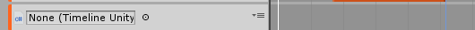
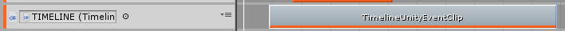
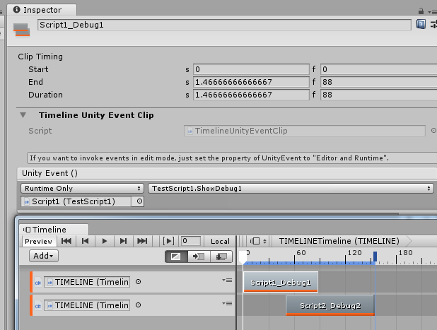
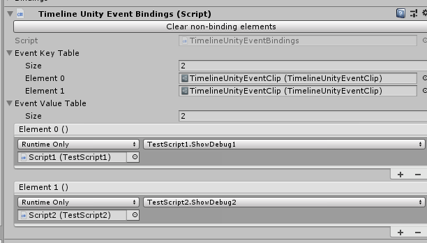

# Unity-TimelineUnityEvent
Using UnityEvent to execute arbitrary code from Unity timelines.

Inspiration reference: https://github.com/georgejecook/UnityTimelineEvents

I replace the former methods with UnityEvent.
I bind UnityEvent and TimelineClip on custom script to store UnityEvent just like PlayableDirector do.

It can even work on same scene, same timeline but different director.

# Usage
Create TimelineUnityEventTrack in Timeline

Add TimelineUnityEventClip. Then it will create a binding script on your director object.

Select clip and set UnityEvent.

The binding script is bound on director.

